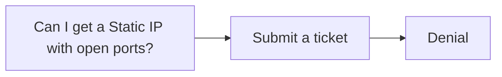
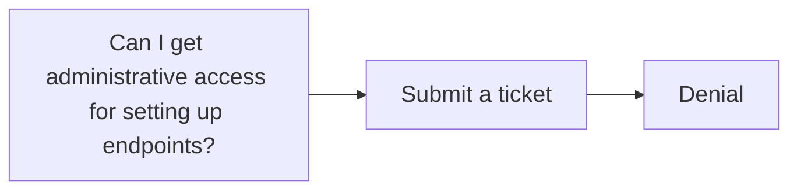
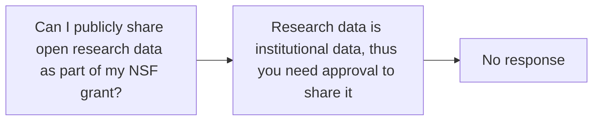
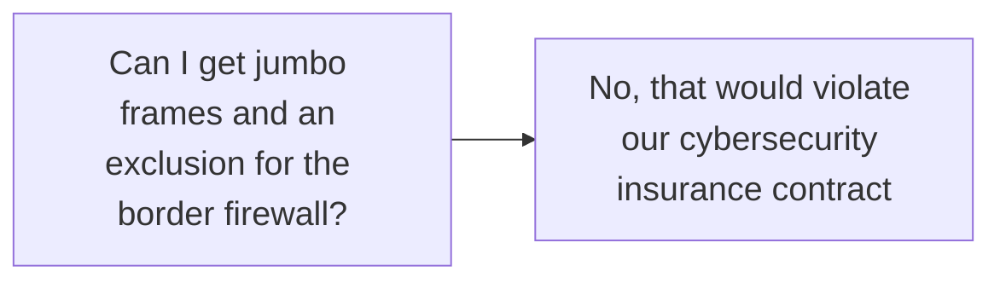
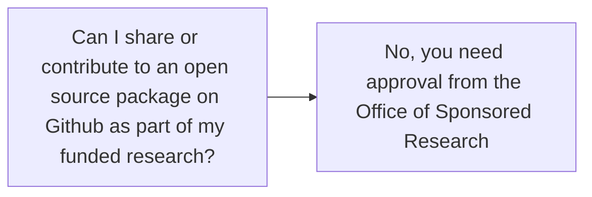
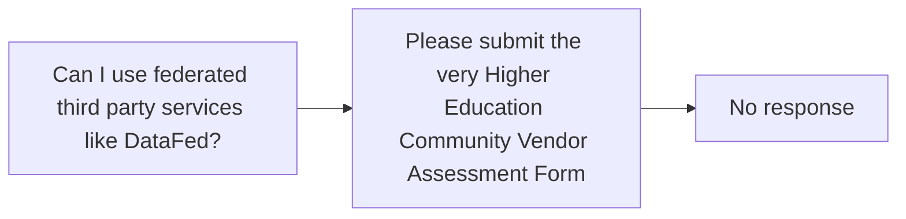

  <h2 class="text-2xl mb-4">Make a photorealistic image of an empty room with absolutely no elephant in the room</h2>
  

---
layout: center
---

  

---
layout: ncolumns
titleText: "DataFed Infrastructure"
columns: 2
images:
  - null
  - null
titles:
  - null
  -null
columnWidths: [1,1]
textboxHeight: 30
mainHeight: 65
<!-- showBorders: true -->
spacerHeight: 0
headingRowHeight: 0
---

<template #col0>

  

  

  

  

  

  

</template>

<template #col1>

</template>

<template #text>

  <ul class="list-disc pl-4">
    <li v-click="6">University IT folks appear believe their policies supersede federal grant contracts  -> even though the grant contract is a legal document</li>
    <li v-click="8">This creates friction between researchers, IT folks, and administrators</li>
  </ul>

</template>
