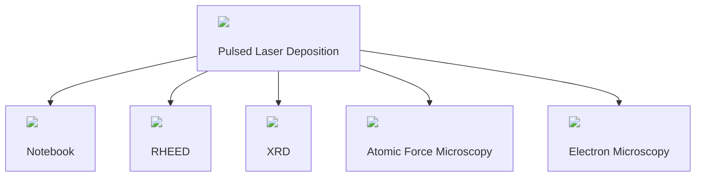

```mermaid
graph TD
  PulsedLaserDeposition[<img src="https://github.com/jagar2/SSMC-CI-Madison-5-20-2025/blob/main/public/icon/PLD-Chamber.png?raw=true" width="100"/> <br/> Pulsed Laser Deposition]
  Notebook[<img src="https://github.com/jagar2/SSMC-CI-Madison-5-20-2025/blob/main/public/icon/notebook.png?raw=true" width="100"/> <br/> Notebook]
  RHEED[<img src="https://github.com/jagar2/SSMC-CI-Madison-5-20-2025/blob/main/public/icon/rheed.svg?raw=true" width="100"/> <br/> RHEED]
  XRD[<img src="https://github.com/jagar2/SSMC-CI-Madison-5-20-2025/blob/main/public/icon/XRD-icon.png?raw=true" width="100"/> <br/> XRD]
  AtomicForceMicroscopy[<img src="https://github.com/jagar2/SSMC-CI-Madison-5-20-2025/blob/main/public/icon/Cypher-2.png?raw=true" width="100"/> <br/> Atomic Force Microscopy]
  ElectronMicroscopy[<img src="https://github.com/jagar2/SSMC-CI-Madison-5-20-2025/blob/main/public/icon/Electron_microscope-01.svg?raw=true" width="100"/> <br/> Electron Microscopy]

  PulsedLaserDeposition --> Notebook
  PulsedLaserDeposition --> RHEED
  PulsedLaserDeposition --> XRD
  PulsedLaserDeposition --> AtomicForceMicroscopy
  PulsedLaserDeposition --> ElectronMicroscopy
```