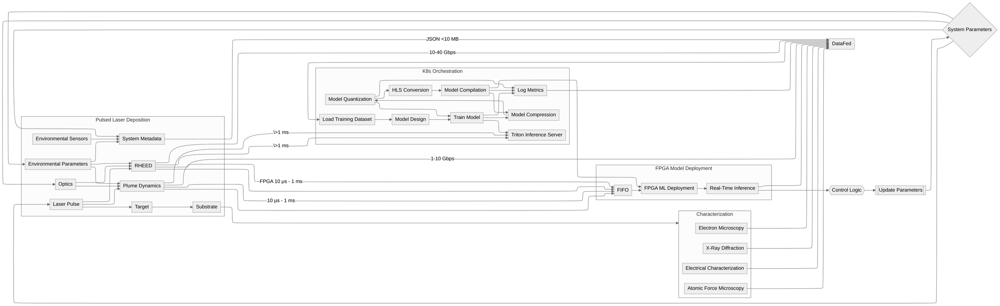

```mermaid {theme: 'neutral', scale: .4}
%%{init: {"theme": "neutral", "flowchart": {"nodeSpacing": 10, "rankSpacing": 10, "padding": 5, "useMaxWidth": false, "defaultRenderer": "elk"}}}%%
graph LR
systemparameters{System Parameters} --> SystemMetadata[System Metadata]
systemparameters --> LaserPulse[Laser Pulse]
systemparameters --> Environmental[Environmental Parameters]
systemparameters --> Optics[Optics]

Substrate --> Characterization[Characterization]

subgraph PulsedLaserDeposition[Pulsed Laser Deposition]
    LaserPulse --> RHEED[RHEED]
    LaserPulse --> PlumeDynamics[Plume Dynamics]
    Environmental --> PlumeDynamics[Plume Dynamics]
    Environmental --> RHEED[RHEED]
    EnvironmentalSensors[Environmental Sensors] --> SystemMetadata[System Metadata]
    Optics --> RHEED[RHEED]
    Optics --> PlumeDynamics[Plume Dynamics]
    LaserPulse[Laser Pulse] --> Target[Target]
    Target --> Substrate[Substrate]
end

subgraph Characterization[Characterization]
    XRD[X-Ray Diffraction]
    AFM[Atomic Force Microscopy]
    Electrical[Electrical Characterization]
    ElectronMicroscopy[Electron Microscopy]
end

XRD --> ScientificDataManagement[DataFed]
AFM --> ScientificDataManagement[DataFed]
Electrical --> ScientificDataManagement[DataFed]
ElectronMicroscopy --> ScientificDataManagement[DataFed]

Environmental --> SystemMetadata[System Metadata]

RHEED --> | \>1 ms| GPUInference
RHEED --> |FPGA 10 μs - 1 ms| FIFO
PlumeDynamics --> | \>1 ms| GPUInference
PlumeDynamics --> |10 μs - 1 ms| FIFO

RHEED --> |10-40 Gbps| ScientificDataManagement[DataFed]
PlumeDynamics --> |1-10 Gbps| ScientificDataManagement[DataFed]
SystemMetadata --> |JSON <10 MB| ScientificDataManagement[DataFed]

ScientificDataManagement --> LoadTrainingDataset

subgraph K8s_Model_Training["K8s Orchestration"]
    LoadTrainingDataset[Load Training Dataset]
    ModelDesign[Model Design]
    TrainModel[Train Model]
    GPUInference[Triton Inference Server]
    LogMetrics[Log Metrics]
    LoadTrainingDataset --> ModelDesign --> TrainModel --> LogMetrics
    TrainModel --> GPUInference 

    TrainModel --> ModelCompression[Model Compression]
    ModelCompression --> ModelQuantization[Model Quantization]
    ModelQuantization --> TrainModel
    ModelQuantization --> LogMetrics

    ModelQuantization --> HLSConversion[HLS Conversion]
    HLSConversion --> ModelCompilation[Model Compilation]
    ModelCompilation --> ModelCompression
    ModelCompilation --> LogMetrics
end

RHEED --> FIFO
PlumeDynamics --> FIFO

subgraph FPGA_Model_Deployment["FPGA Model Deployment"]
    ModelCompilation --> FPGADeployment[FPGA ML Deployment]
    FIFO[FIFO]
    RealTimeInference[Real-Time Inference]
    FIFO --> FPGADeployment --> RealTimeInference
end

RealTimeInference --> ScientificDataManagement[DataFed]

RealTimeInference --> ControlLogic{{Control Logic}}
ControlLogic --> UpdateParameters[[Update Parameters]]
UpdateParameters --> systemparameters

LogMetrics --> ScientificDataManagement[DataFed]
```

